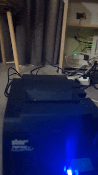

# Thermal Print Server

HTTP print server for a Star TSP143IIU+ thermal printer, running on a Raspberry Pi.



## Goal

Inspired by https://guestbook.goodenough.us/info and https://ntfy.sh/. I wanted something similar for myself. 
I tried to use https://www.npmjs.com/package/node-thermal-printer but my printer was not supported. So I re-implemented this solution in node.js: https://github.com/geftactics/python-StarTSPImage/tree/main

## Disclosure

Mostly vibe coded.

## Prerequisites

- A Raspberry Pi with the Star TSP143IIU+ connected via USB
- SSH access to the Pi from your Mac (same LAN)

## Setup

All commands run on your Mac. The scripts SSH into the Pi automatically.

1. Create a `.env` file:

```
PRINTER_PI=user@<pi-ip-address>
```

2. Make sure you can `ssh $PRINTER_PI` without a password prompt (use `ssh-copy-id` if needed).

3. Run the setup script (from your Mac):

```
./setup.sh
```

This SSHs into the Pi and installs CUPS, Node.js, the Star CUPS driver, and the systemd service. It also rsyncs the repo to the Pi.

## Deploy

After making changes locally, deploy from your Mac:

```
./deploy.sh
```

This rsyncs the repo to the Pi, installs deps, and restarts the service. Don't edit files on the Pi directly — they'll be overwritten on next deploy.

## Endpoints

| Endpoint | Body | Description |
|----------|------|-------------|
| `POST /api/printer/label` | `{ "text": "..." }` | Print a centered label |
| `POST /api/printer/receipt` | `{ "items": [...], "total": N }` | Print a receipt |
| `POST /api/printer/image` | Raw PNG bytes | Print a PNG image |
| `POST /api/printer/canvas` | Raw RGBA bytes (`?width=N&height=N`) | Print raw canvas pixel data |
| `POST /api/printer/test` | (none) | Print a text style sampler |
| `GET /api/printer/health` | (none) | Printer status + queue depth |

## Testing

Run from your Mac — requests go to the Pi over the LAN.

JSON endpoints (label, receipt) have Bruno collections in `bruno/`.

Binary endpoints (image, canvas) have curl scripts with sample images in `scripts/`:

```
./scripts/test-image.sh ./scripts/berend.png
./scripts/test-image.sh ./scripts/pip.png
./scripts/test-canvas.sh data.rgba 576 400
```

The default base URL is read from `PRINTER_PI` in your `.env`. Pass a second argument to override it.

## Logs

```
source .env && ssh $PRINTER_PI journalctl -u print-server -f
```
